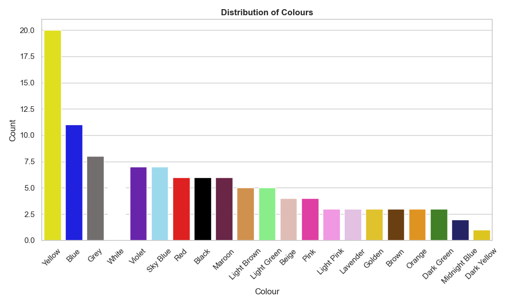
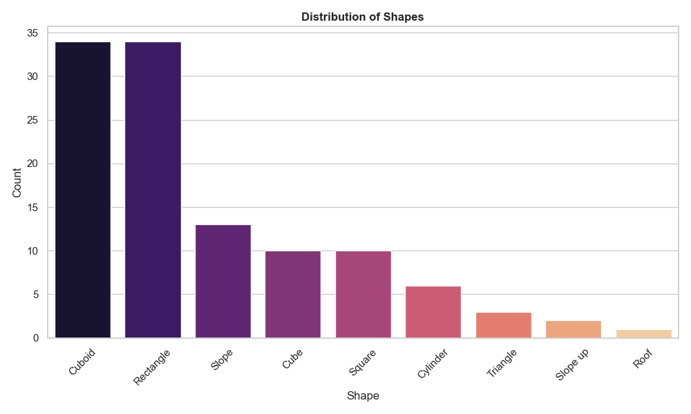

# Group 2 - Lego Inventory Analysis

## Overview

This project involves a detailed analysis of a Lego brick dataset with attributes such as colour, shape, height, units, and age group. The primary objective is to inventory and analyze these features, uncovering characteristics and trends among different brick types through data processing, normalization, and visual analysis.

## Project Structure

- **Data Collection**: We started by manually counting the Lego bricks and recording the inventory in an Excel file. The dataset was divided into five normalized tables to improve data consistency and reduce redundancy.
  
- **Data Processing**: 
- Loaded the tables from the Excel file, excluding the "Original sheet".
- Merged the tables on shared keys like `colour_id`, `sof_id`, `age_id`, and `height_id` to create a consolidated dataset.
- Cleaned the data by removing unnecessary columns and renaming duplicates for clarity.

- **Visual Analysis**: Generated visualizations to highlight the distribution of colours, shapes, units, height categories, and age groups among Lego bricks.

- **Insights**: Key insights were derived from the analysis, identifying trends in colour popularity, shape variety, and the specificity of age groups for targeted Lego designs.

## Database Structure

The inventory was divided into five tables for a normalized database:

1. **Main Table (Inventory)**:
   - Attributes: `unique_id`, `nod`, `colour_id`, `sof_id`, `height_id`, `age_id`, `units`
   - Purpose: Main list of Lego bricks, linking to other tables for colour, shape, height, and age group details.

2. **Colour Table**:
   - Attributes: `colour_id`, `colour_name`, `colour_fill`, `colour_code`
   - Purpose: Stores color information, including a unique identifier, name, and colour code.

3. **Shape of Form (SoF) Table**:
   - Attributes: `sof_id`, `shape`, `type`
   - Purpose: Classifies shapes like `Cube`, `Slope`, `Cylinder`, etc.

4. **Age Group Table**:
   - Attributes: `age_id`, `age_group`
   - Purpose: Indicates target age ranges (e.g., `3-5 years`, `6-8 years`).

5. **Height Table**:
   - Attributes: `height_id`, `height_name`
   - Purpose: Defines height categories such as `Normal` and `Low`.

## Visualizations

### Examples:
- **Distribution of Colours**: 
- **Distribution of Shapes**: 
- **Combined Plot (Units, Height, Age Group, Type)**: 

## Files

- **Notebook**: [ASDA_assignment_2.ipynb](ASDA_assignment_2.ipynb) - Contains the code for loading, processing, and visualizing the Lego inventory data.
- **Data Source**: [ASDA_assignment_2.xlsx](ASDA_assignment_2.xlsx) - The source file containing all Lego inventory data in a structured format.
- **Final Report**: [final_report.md](final_report.md) - Detailed documentation of the project’s objectives, methods, findings, and recommendations.

## How to Run

1. Clone this repository to your local machine.
2. Open `ASDA_assignment_2.ipynb` in Jupyter Notebook.
3. Run all cells to reproduce the data processing steps, visualizations, and analysis.