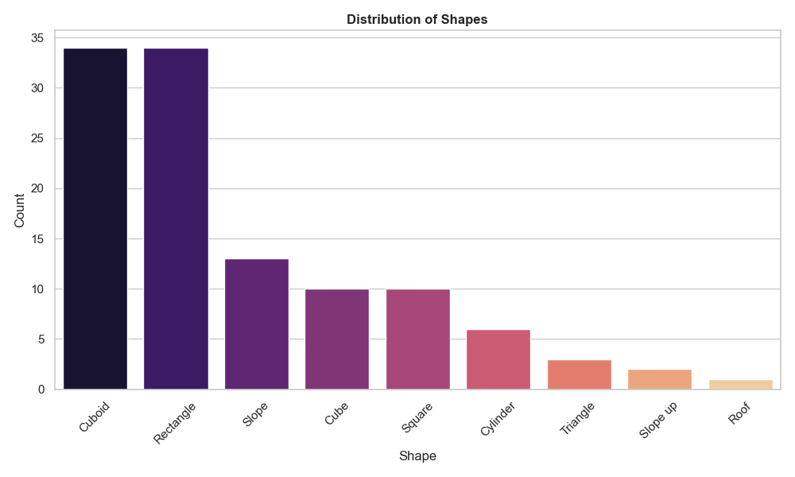

# Lego inventory analysis - Final Report

## Project Overview

This project focuses on analyzing a dataset of bricks with various attributes such as color, shape, height, units, and age group. The primary goal is to explore and visualize the distribution of these features to better understand the characteristics of the bricks. Using Python libraries such as Pandas, Seaborn, and Matplotlib, we conducted an in-depth analysis and generated visualizations to summarize our findings.

## Data Processing and Cleaning

The dataset consisted of multiple tables, which were merged based on key identifiers to form a consolidated dataset for analysis. Key steps included:

1. **Data Loading**: Importing the necessary tables from the Excel file, excluding the "Original sheet" page.
2. **Data Merging**: Combining tables on shared keys such as `colour_id`, `sof_id`, `age_id`, and `height_id`.
3. **Data Cleaning**: Dropping unnecessary columns and renaming duplicated columns to ensure clarity.

The final dataset was ready for analysis after completing these steps.

## Visual Analysis

To gain insights into the distribution of various attributes, we created several visualizations.

### 1. Distribution of Colors

This count plot displays the distribution of colors among the bricks, with each color bar representing the frequency of that color. This visualization helps identify the most common and rare colors in the dataset.

### 2. Distribution of Shapes

The shape distribution plot illustrates the count of different shapes in the dataset, allowing us to identify which shapes are more prevalent.

### 3. Distribution of Units, Height, Age Group, and Type

This figure includes four subplots:
   - **Units**: Shows the count distribution of units associated with each brick.
   - **Height**: Displays the frequency of different height categories (e.g., Normal, Low).
   - **Age Group**: Visualizes the age group distribution to identify the target audience for each type of brick.
   - **Type**: Represents the distribution of different brick types.

## Conclusions

Based on the analysis, we observed several key insights:

1. **Color Trends**: Certain colors are more common among bricks, which may indicate popularity or preference in design.
2. **Shape Variety**: A few shapes, like cuboids and rectangles, dominate the dataset, suggesting they are the most commonly used.
3. **Units by Type**: The units distribution varies across different types, potentially reflecting variations in brick sets or packages.
4. **Age Group Specificity**: The age groups provide insight into which bricks are intended for which age ranges, supporting targeted marketing or design decisions.

## Appendix

- **Notebook**: [ASDA_assignment_2.ipynb](ASDA_assignment_2.ipynb)
- **Data Source**: [ASDA_assignment_2.xlsx](ASDA_assignment_2.xlsx)