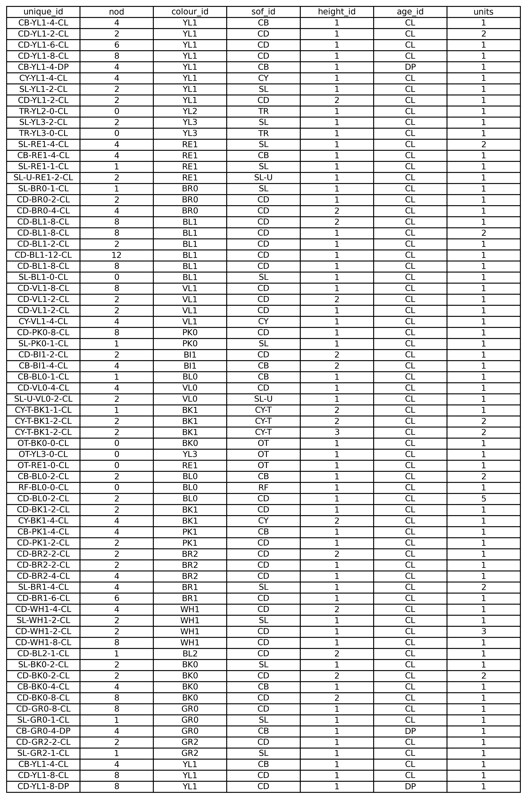
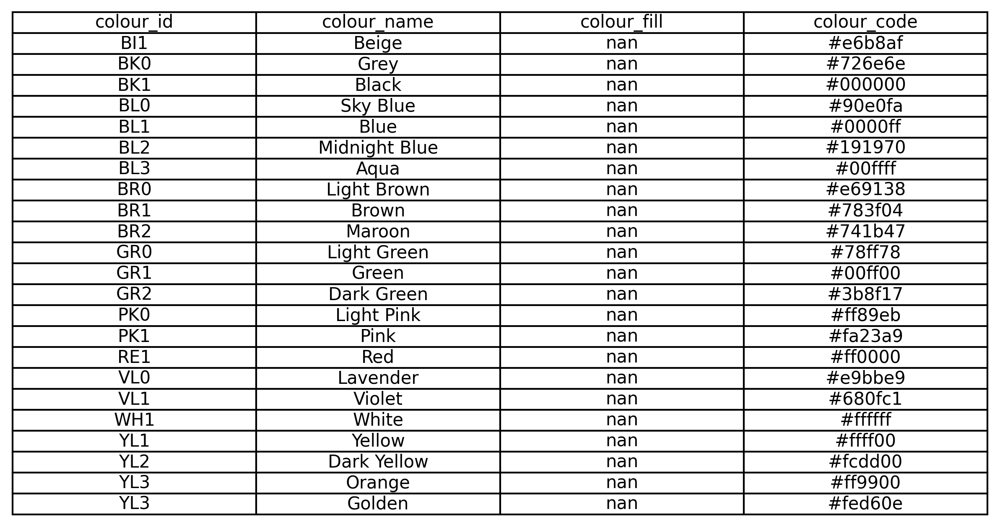
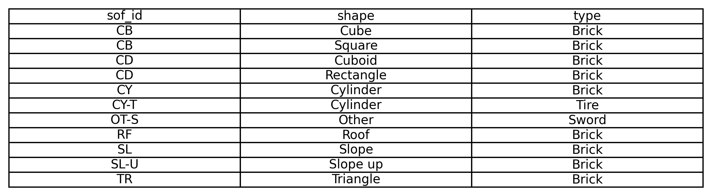
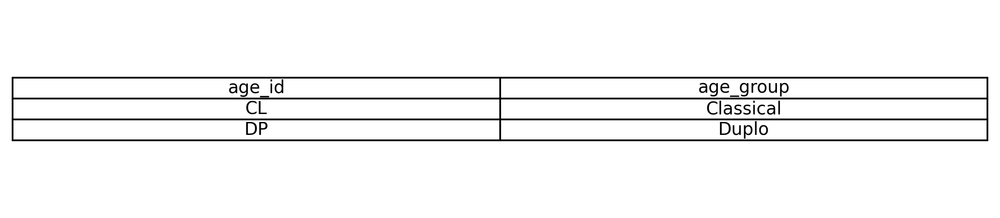
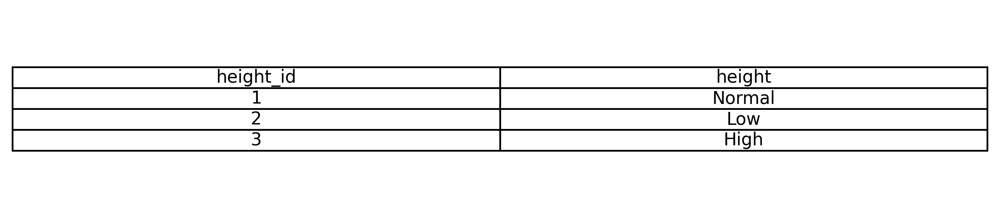
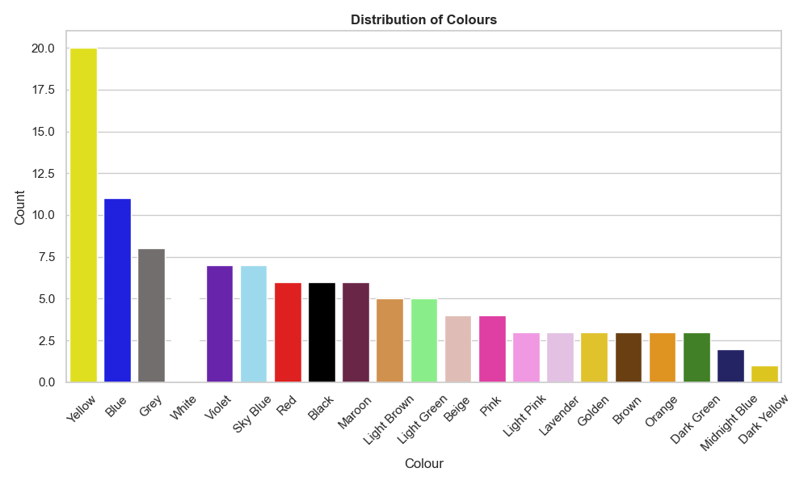
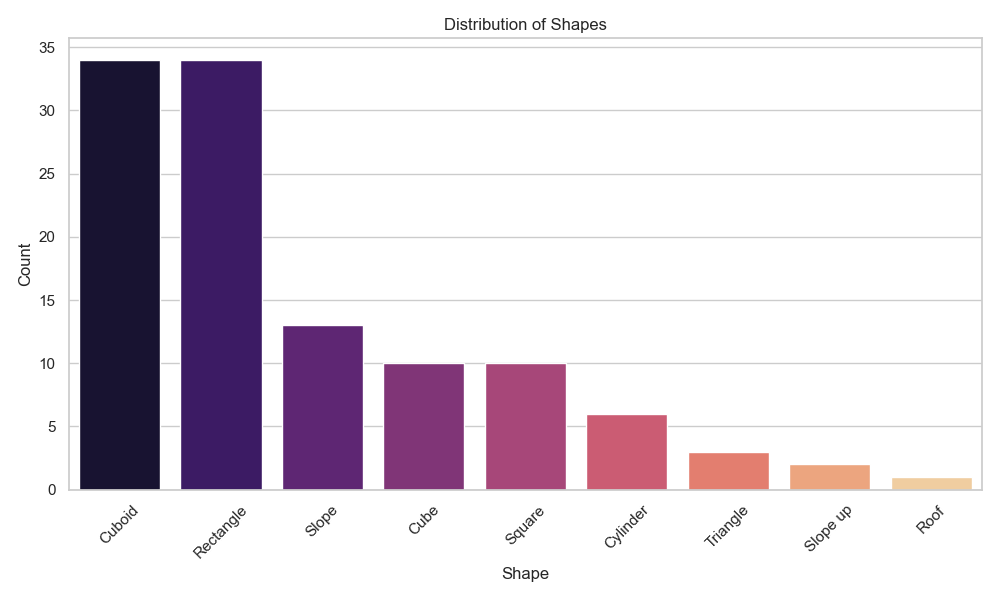
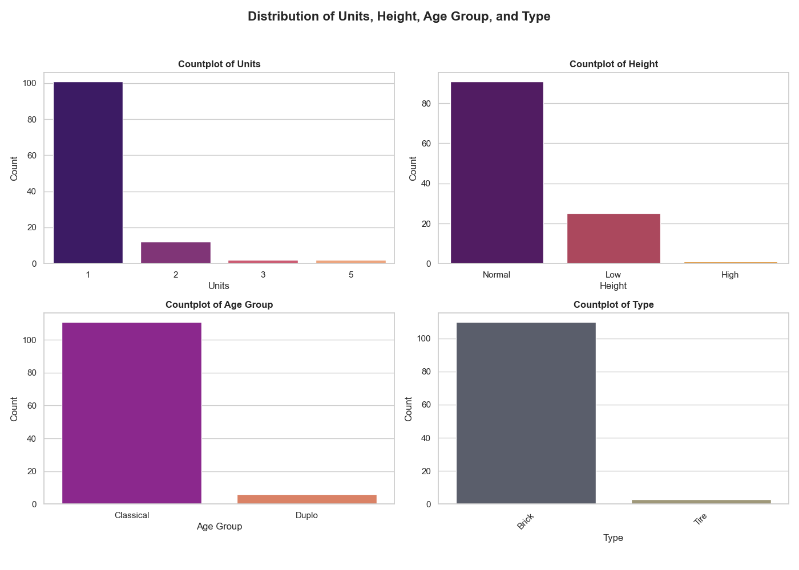

# Lego inventory analysis - Final Report

## Project Overview

This project focuses on creating an inventory of available Lego bricks, analyzing their attributes, and performing a distribution analysis on various features such as colour, shape, height, units, and age group.

### Inventory Process

To start, we manually counted the available Lego bricks and documented their details. This inventory was then recorded in an Excel table, which was subsequently divided into five separate tables. These tables were structured to normalize the database and improve data consistency, representing different attributes like colour, shape, and type. After normalization, the tables were merged using key identifiers for analysis.

### Database Structure and Tables

The Lego inventory data was divided into five normalized tables, each containing distinct attributes:

1. **Main Table (Inventory)**:
   - **Features**: `unique_id`, `nod`, `colour_id`, `sof_id`, `height_id`, `age_id`, `units`
   - **Purpose**: This main table lists each Lego brick entry by its unique identifier and references other tables for attributes like colour, shape, height, and age group through foreign keys.
   

2. **Colour Table**:
   - **Features**: `colour_id`, `colour_name`, `colour_fill`, `colour_code`
   - **Purpose**: Stores color information, with each colour having a unique identifier, a descriptive name, and a colour code (e.g., hex or RGB) for visual reference.
   

3. **Shape of Form (SoF) Table**:
   - **Features**: `sof_id`, `shape`, `type`
   - **Purpose**: Describes the shape of each Lego brick, allowing for classification by forms such as `Cube`, `Slope`, `Cylinder`, etc. This provides a reference for the shape types used in the main inventory.
   

4. **Age Group Table**:
   - **Features**: `age_id`, `age_group`
   - **Purpose**: Classifies bricks by their target age group, providing insight into age-specific categories for better segmentation (e.g., `Classical`, `Duplo`, etc.).
   

5. **Height Table**:
   - **Features**: `height_id`, `height_name`
   - **Purpose**: Specifies the height category of each brick, with typical values like `Normal`, `High` or `Low`. This allows us to standardize height descriptions in the inventory.
   

Each table was designed to hold unique information and is linked by identifiers, creating a well-structured and normalized database for analysis.

## Data Processing and Cleaning

After setting up the normalized database, we proceeded with the following steps:

1. **Data Loading**: Imported the necessary tables from the Excel file, excluding the "Original sheet" page.
2. **Data Merging**: Combined the five tables on shared keys such as `colour_id`, `sof_id`, `age_id`, and `height_id` to form a consolidated dataset.
3. **Data Cleaning**: Dropped unnecessary columns and renamed duplicated columns to ensure clarity and consistency.

With the combined and cleaned dataset, we proceeded with our analysis.

## Visual Analysis

To gain insights into the distribution of various attributes, we created several visualizations.

### 1. Distribution of Colors

This count plot displays the distribution of colours among the bricks, with each color bar representing the frequency of that colour. This visualization helps identify the most common and rare colors in the dataset.

### 2. Distribution of Shapes

The shape distribution plot illustrates the count of different shapes in the dataset, allowing us to identify which shapes are more prevalent.

### 3. Distribution of Units, Height, Age Group, and Type

This figure includes four subplots:
- **Units**: Shows the count distribution of units associated with each brick.
- **Height**: Displays the frequency of different height categories (e.g., Normal, Low).
- **Age Group**: Visualizes the age group distribution to identify the target audience for each type of brick.
- **Type**: Represents the distribution of different brick types.

## Conclusions

Based on the analysis, we observed several key insights:

1. **Color Trends**: Certain colours are more common among bricks, which may indicate popularity or preference in design.
2. **Shape Variety**: A few shapes, like cuboids and rectangles, dominate the dataset, suggesting they are the most commonly used.
3. **Units by Type**: The units distribution varies across different types, potentially reflecting variations in brick sets or packages.
4. **Age Group Specificity**: The age groups provide insight into which bricks are intended for which age ranges, supporting targeted marketing or design decisions.

## Recommendations

Further analysis could be conducted to:

- Examine potential relationships between colour and shape.
- Analyze specific features in the context of age group preferences.
- Explore time-based trends if historical data becomes available.

## Appendix

- **Notebook**: [ASDA_assignment_2.ipynb](ASDA_assignment_2.ipynb)
- **Data Source**: [ASDA_assignment_2.xlsx](ASDA_assignment_2.xlsx)